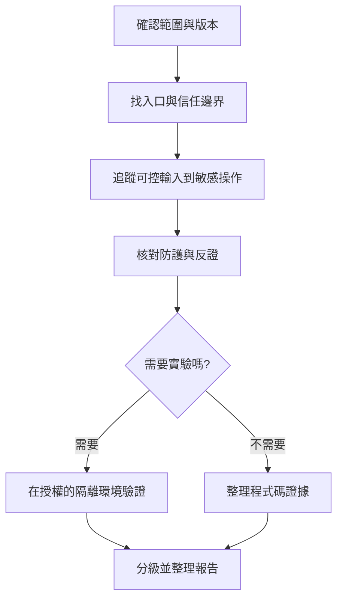

# 安全風險與紅隊檢查

紅隊從攻擊者能控制的輸入出發, 追蹤到敏感操作, 檢查登入, 權限與資料邊界是否有效, 交付可核對的問題或已檢查結果

## 先確認範圍

記錄目標 repository 與版本, 要檢查整個應用程式或指定 diff, 可使用的測試環境與報告位置

原始碼審查以唯讀方式進行, 需要執行驗證時指定隔離環境與合成資料, 帳戶操作, 真實服務測試與修復分別確認授權

保存其他人的變更, 環境缺少相依或權限時先交付能完成的檢查, 列出需要補足的項目

## 安排獨立審查

提供原始需求, 適用規則, 實際程式碼版本與已完成的檢查, Reviewer 自行追蹤問題與反證, Main 負責範圍與最終驗收

依信任邊界或功能介面分工, 讓同一條攻擊路徑能連續追蹤, 要審查的程式先固定為 commit, patch 或明確的檔案版本

## 檢查流程

信任邊界是資料從不同身分或環境進入系統的位置, 例如未登入使用者送出請求, 或外部服務回傳資料

從入口核對身分驗證, 授權, session, 輸入驗證, 編碼與錯誤處理, 再追到資料讀寫或對外操作

例如檢查訂單查詢時, 除了確認使用者已登入, 也要確認該使用者是否有權讀取指定訂單

## 用反證排除誤判

對每個候選問題確認:

- 攻擊者能控制哪些輸入
- 這條路徑是否真的能走到敏感操作
- 其他層是否已有有效防護
- 需要哪些帳號, 設定或部署條件
- 觸發後造成什麼具體影響

需要引用 CVE 時核對版本, 啟用功能與可達路徑, 確認問題的根因後再提出修復

## 問題報告需要的證據

| 項目 | 保存內容 |
|---|---|
| 位置與版本 | 檔案, symbol, 行號與檢查版本 |
| 觸發條件 | 攻擊者能力, 輸入與必要前提 |
| 攻擊路徑 | 入口, 防護與敏感操作的關係 |
| 影響 | 機密性, 完整性或可用性的具體損害 |
| 驗證 | 實際檢查, 結果, 反證與待確認條件 |
| 修復方向 | 對應根因的最小調整 |

結果分成已確認問題, 待驗證問題, 防禦性建議與環境限制, 沒有找到具體問題時說明已檢查範圍

## 讓交接能直接接續

沿用正在使用的安全工具報告格式, 附上入口, 防護與敏感操作的關鍵片段, 生效設定, 呼叫端及資料流

保留穩定的問題 ID, 已排除假設與未解相依, 接手者先核對這些證據, Main 複查有爭議的防護與關鍵因果關係

工具要求的檢查與審核步驟依其工作流程完成, 受阻時記錄具體原因並交付已完成部分

## 驗收與公開資料

報告列出已檢查模組, 未涵蓋範圍與待執行的環境驗證, 修復後重驗受影響路徑, 證據對應同一份內容版本

私有程式碼, 連線位址, credentials, 客戶資料與可識別系統的漏洞細節留在授權報告, Playbook 保存通用方法與虛構範例
