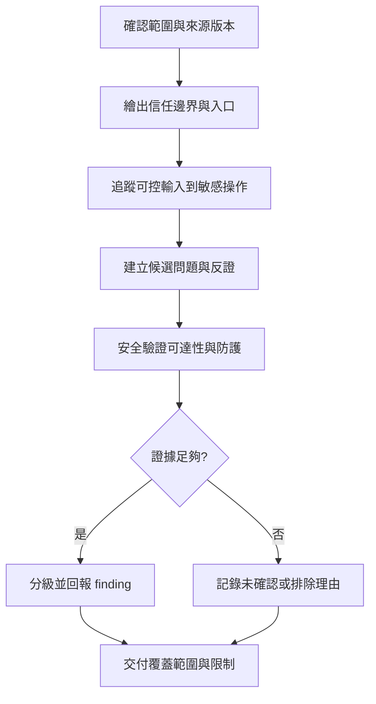

# 獨立紅隊檢查的治理與方法

紅隊從攻擊者能控制的輸入與實際可達路徑檢查安全邊界, 目的在找出可驗證的風險, 不是證明系統必然有漏洞. 檢查與修復分開授權, 沒有 finding 也是有效結果

## 範圍與授權

開始前確認 repository / revision, 檢查整個應用程式或指定 diff, 允許的驗證環境, 不可觸及的服務及報告位置. 本地 source review 不代表獲准攻擊部署環境, 使用帳號, 取得真實資料或執行破壞性測試

預設只讀原始碼與必要設定, 保留 concurrent work. 不安裝依賴, 不修復環境, 不調整權限或 VPN; 需要額外操作時說明目的與最小範圍, 按實際授權處理

## 獨立性與 ownership

Reviewer 取得原始目標, 適用規則, 真實 source state 與既有驗證限制, 不先提供希望得到的結論. Main 保留範圍與最終驗收, reviewer 擁有 discovery, validation 與證據整理的完整迴圈

依風險與介面劃分工作, 不按檔案數量平均拆分; 同一條攻擊路徑需要連續追蹤. 不例行建立多層 reviewer, 不把 model 或角色名稱當成安全保證

## 檢查流程

先辨識身分驗證, 授權, session, 外部輸入, 資料存取與對外服務等實際邊界; 再從入口追蹤到敏感操作, 核對中間的驗證, 編碼, 權限與錯誤處理. 不以出現某個危險 API 名稱就判定漏洞

候選問題需要反證: 輸入是否真的可控, 路徑是否可達, 防護是否在其他層, 權限與部署條件是否成立. 能以只讀程式分析排除的問題不額外執行; 必要實驗用允許的隔離環境與合成資料, 不測試真實客戶資料

## Finding 的最低證據

| 項目 | 應記錄內容 |
|---|---|
| 位置與版本 | 實際 file / symbol / line, source revision 或相關 diff 狀態 |
| 觸發條件 | 攻擊者能力, 可控輸入, 所需帳號或部署前提 |
| 攻擊路徑 | 入口到敏感操作, 既有防護與不足處 |
| 影響與分級 | 具體機密性, 完整性或可用性影響, 不誇大可達範圍 |
| 驗證 | 已做檢查, 結果, 反證與仍未確認的條件 |
| 建議 | 對應 root cause 的最小修復方向, 不混入無關重構 |

區分已確認 finding, 合理但未驗證的問題, 防禦性建議與環境限制. 版本老舊, 缺少測試或規則警告本身不一定是可利用漏洞; 若引用 CVE 必須核對實際版本, 啟用功能與可達條件

## 第一次交接就保留足夠證據

沿用正在使用的安全工具 schema, 不另創互不相容的 finding 格式. 回傳候選時一併附 source revision, 關鍵程式片段與用途 (入口, 註冊, 防護或敏感操作), 生效的設定 / 呼叫端, 攻擊者所需前提, 方向明確的資料流, 反證與影響 / 可能性分級理由; class 存在, 已註冊與實際部署啟用是不同證據

保留穩定 candidate ID, 已排除假設與未解相依, 避免換 owner 後重查同一路徑. 每個子工作明列入口及停止條件, 分開交付已檢查部分, 未覆蓋部分與需要外部證據的問題; inventory 或搜尋命中不算完成 review. Main 驗證關鍵因果關係與有爭議防護, 不為形式重讀所有已審查檔案

此格式是交接補充, 不取代既有安全外掛的 preflight, 獨立驗證或 finalization gate; partial coverage 仍需明確標示, 不能因報告已生成就改稱全專案通過

## 驗收與資料保護

報告明列已檢查模組與路徑, 未覆蓋部分, 未執行的 runtime / dependency / deployment 檢查, 不將單次 source review 描述為完整安全認證. 後續變更只重驗受影響路徑, 既有證據需對應版本

私有原始碼, endpoint, secret, 客戶資料與可識別專案的漏洞細節留在授權的私人報告. 公開 playbook 只保存通用方法與抽象例子; 不將私人報告直接去掉名稱後發布, 仍需檢查組合資訊能否識別系統

使用安全檢查工具或 Skill 時遵循當下可用 workflow, preflight 與 report format; 工具不可用或審核未通過時保留具體阻擋, 不改稱一般 review 來繞過必要 gate. 本文件不宣稱任何特定專案已完成檢查
