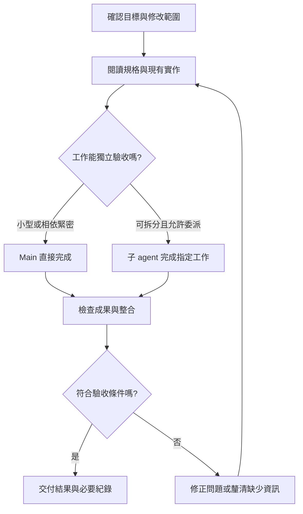

# 從需求到驗收

先說清楚要交付的結果, 再閱讀相關資料, 修改並驗證, 小型工作由 Main 直接完成, 能獨立交付的部分再評估分工

## 1. 把需求變成可驗收的結果

用操作情境描述功能, 包含輸入, 操作與預期結果, 例如訂單查詢要檢查查詢成功, 查無資料與連線失敗

同時交代可修改的範圍, 必須保留的 API 格式與本次排除項目, 若只要規劃或程式碼審查, 直接指定交付類型

資訊不足時, 將問題分成兩部分:

- 需要先確認的部分, 例如 API 欄位有衝突, 需確認資料格式後才能串接
- 能先完成的部分, 例如沿用現有元件完成畫面, 或用測試資料檢查互動

新的架構決策, 公共介面變更或範圍擴張交由 Main 整理, 必要時向使用者確認

## 2. 確認專案與目前變更

先讀適用的 AGENTS.md, 任務規格與相似實作, 從實際檔案確認語言, Framework (框架), Runtime (執行環境), 套件管理工具與測試方式

在目標 repository 檢查 Git branch, HEAD 與 status, 閱讀相關 diff, 保存既有未提交變更, 也直接檢查被忽略的本機指示與必要規格

搜尋時先找名稱與引用, 再讀相關段落, 跨檔案關係不清楚時查詢 symbol 與 references, 需要比較其他專案做法時只讀相關實作

換到新 worktree 後重新確認本機規格, 測試資料, 服務與未提交檔案, Worktree 隔離工作目錄, 共用資料庫或服務仍需另外安排

## 3. 釐清每份來源管什麼

| 來源 | 通常決定的內容 |
|---|---|
| 畫面與流程規格 | 顯示內容, 操作順序與互動狀態 |
| API 規格 | 欄位名稱, 資料格式, 錯誤與相容性要求 |
| 專案指示 | 架構邊界, 命名方式與驗證規則 |
| 現有實作 | 目前行為與可沿用的程式 |
| 已確認的新決策 | 本次要調整的需求與適用範圍 |

若已有 Markdown 抽出版, 先查來源標記與相關段落, 遇到缺漏, 衝突或需要核對畫面時回查原始文件與截圖

來源有矛盾時記錄衝突位置, 適用版本與受影響行為, 由 Main 釐清後再修改, 紀錄使用實際核對過的來源

## 4. 選擇分工方式

| 方式 | 適合情境 | 交付內容 |
|---|---|---|
| Main 直接執行 | 小型修改, 相依緊密或需要大量既有決策 | 修改結果與驗收證據 |
| Explorer 調查 | 需要先查清楚一個程式碼問題 | 相關位置, 呼叫關係與待確認事項 |
| Worker 實作 | 範圍與共享介面明確, 能獨立驗收 | 完成修改, 檢查與範圍內修正 |
| 另一個使用者對話 | 大型獨立交付, 需要自己的長期追蹤 | 該交付的決策, 進度與後續維護 |

委派依使用者要求或適用指示執行, 建立或傳訊到另一個使用者對話需有該動作的明確授權, 先確認是否已有合適的對話可接續

需要保留歷史時可使用 fork, 需要重新整理資料時使用新對話與精簡交接, 判斷重點是工作相依與後續維護方式

## 5. 選擇 model 與角色

需求不明, 跨模組相依或介面影響較大的工作, 選擇能處理這些判斷的 model, 做法與驗收明確的子工作則可使用較輕量的 model

沿用目前用戶端支援的 model 與 effort, effort 是推理程度設定, 省略時依有效預設值執行

啟動子工作時核對指定參數, 預設設定與角色綁定的 model, 再查看實際啟動結果, 修改設定後依用戶端方式重新載入並確認

## 6. 安排責任與共享資源

一個負責人接手同一功能的閱讀, 修改, 檢查與修正, Main 處理跨模組決策, 整合與最終驗收

平行工作前先確認共享的 API, properties 與 events, 例如 Host 管理登入狀態與路由, custom element 管理功能 UI, Backend 提供資料介面

也要安排測試資料, ports, 暫存檔, 瀏覽器 session 與共用服務, 後一步需要前一步產物時依序執行

## 7. 保存必要進度

小型工作使用目前對話即可, 多人或多 agent 工作沿用專案已有的進度紀錄

| 項目 | 要回答的問題 |
|---|---|
| 工作 ID 與負責人 | 誰在做, 如何找到這項工作? |
| 範圍與相依 | 可以改什麼, 開始前需要什麼? |
| 來源與版本 | 依哪份規格與決策執行? |
| 驗收條件 | 哪些結果算完成? |
| 產物與檢查 | 改了什麼, 檢查的是哪份內容? |
| 問題與下一步 | 還缺什麼, 由誰接續? |

狀態使用執行中, 受阻, 待驗收與已驗收, 子工作回報完成後由 Main 對照成果驗收

## 8. 納入中途修正

使用者的新訊息通常是在調整目前任務, 保留原目標並納入新限制

將變更整理成來源位置, 版本或時間, 舊決策, 新決策與受影響範圍, 更新給實際負責人, 回傳時確認已採用有效決策

子 agent 使用允許的協作管道, 另一個使用者對話則依授權傳訊, 暫時沒有傳遞管道時先保存在目前紀錄, 依賴該變更的成果保持待驗收

## 9. 按改變的行為驗證

先用能直接檢查本次改變的既有方法, 再依相依與失敗結果擴大範圍

| 修改類型 | 優先檢查 |
|---|---|
| 純文案或文件 | textlint, 語意, 連結與範例 |
| 函式或運算邏輯 | 代表輸入, 邊界值與單元測試 |
| UI 與互動 | 實際頁面, 操作狀態, 鍵盤與焦點 |
| API 或資料流 | 欄位, 錯誤處理, 真實串接或整合測試 |
| 非同步狀態 | 切換頁面或重新查詢後, 舊回應是否覆蓋新狀態 |

Mock 使用模擬回應, 能檢查對應邏輯, 真實 API 與資料庫串接另用測試環境驗證, 發布時按專案既有流程執行 CI 與發布檢查

檢查紀錄包含內容版本, 環境, 結果與未涵蓋情境, 後續改到相同行為或出現新失敗時重跑相關檢查

Main 對照原始需求, 穩定的 diff 與實際成果驗收, 有需要獨立判斷的具體風險時再安排 reviewer

## 10. 交付與接續

完成時先說明結果, 再列必要變更, 檢查與待處理事項, 仍需等待的子工作留在本次完成流程中

交接或 Context 壓縮 (compaction) 前, 保存目標, 授權, 已確認決策, 負責人, 產物版本, 檢查結果與下一步, 接續時先與現況對照

更換負責人前確認前一位已停止或完成, 再轉移修改責任, 重複失敗時保留錯誤與嘗試紀錄, 重新判斷處理方向

持續追蹤工作依已設定的排程或通知管道執行, 需要建立新排程時另行處理
