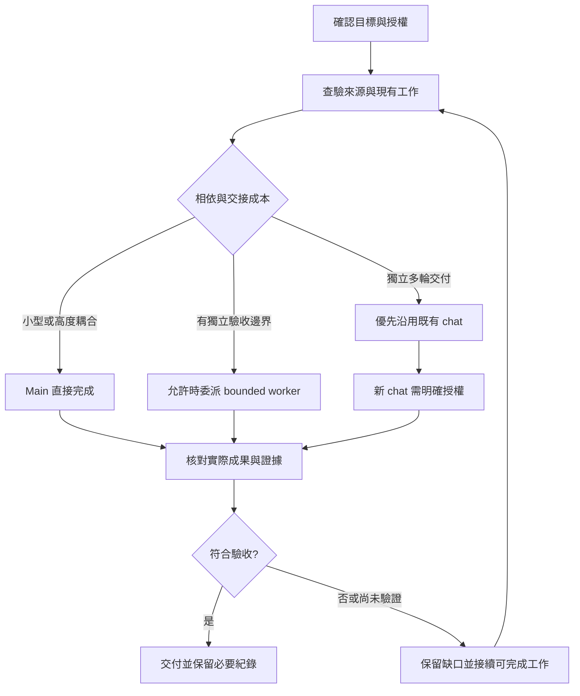

# 從需求到可驗收交付

每次先決定這次要交付什麼, 哪些行為已獲授權, 以及什麼證據足以驗收 再選擇 owner 與工具, 不先排固定 agent 流程

新專案先確認自己的技術棧與規範, 再依問題選讀其他近期 repository 的相關實作; 比較版本, 相依與使用情境, 不把過往專案架構直接套用, 也不每次掃描全部 repository

## 1. 接住目標與授權

將需求整理成可觀察的結果, 例如某個輸入情境應產生什麼畫面或資料; 保留使用者已確認的限制, exclusions 與 acceptance criteria

區分要求實作, review, report, prompt 或 handoff; 只要求 artifact 時交付該 artifact, 要求實作時持續完成已授權的工作

缺少資訊時, 先判斷它是否阻擋目前行為 規格衝突, API 欄位或權限未確認只阻擋依賴該資訊的部分; 仍可完成獨立且已授權的 UI, local fixture 或 read-only 調查

不要把選一個做法推導成可以改公共介面, 也不要把 frontend 任務擴張成 backend 修改

## 2. 本地 discovery

先讀任務直接相關的指示, 原始碼, 設定, diff 與相似實作; 用檔案與設定確認 Framework, Language, Runtime, Package Manager, Architecture 與 toolchain

先搜尋名稱與引用, 再讀命中的必要段落; 獨立查詢可批次處理 不要為了取得一個已知 Symbol 啟動多個 agent, 也不要每次掃描整個 repository

確認 Git branch / HEAD, 未提交與 untracked 變更, ignored 治理檔, 目前 checkout, formatter 與 focused check 的可用性; 保留其他人的工作

新 worktree 的檔案狀態需重新核對, 特別是 ignored 指示與本機規格 另一個 checkout 不保證包含目前未提交內容, 也不代表共用測試資料與服務已隔離

## 3. 確定來源權威

規格工作先找到相符的 Markdown 抽出版, 讀相關段落及來源標記; 不限定檔名或目錄

需要畫面證據, 內容缺漏, 過期, 不明確, 衝突或明確要求原始核對時, 回查必要的原始文件與截圖 無抽出版時讀原始來源的相關範圍, 不自行建立新的抽出流程

不同來源可各自控制不同內容, 例如畫面規格控制 UI 與流程, API 規格控制欄位名稱與資料格式 保留來源的適用範圍, 日期與已確認決策; 抽出文字不因此取得較高權威

只讀過抽出版就只能宣稱核對抽出版 原始來源矛盾時記錄爭點與受影響行為, 讓 Main 解讀或向使用者釐清, 不由 worker 猜測填滿

## 4. 選擇執行路徑

| 路徑 | 適合情境 | 完成責任 |
|---|---|---|
| Main 直接執行 | 小型, 高度相依, context-heavy 或交接會重做主要工作 | Main discovery, edit, check 與驗收 |
| Explorer 後執行 | 一個清楚的 codebase 問題能消除後續不確定性 | Explorer 回報來源與 unknowns, 實作 owner 接續 |
| Bounded worker | 已有確認邊界, 可獨立驗收, context 隔離或並行有具體價值 | Worker 完整執行, Main 整合驗收 |
| 既有或新使用者 chat | 大型獨立交付需要自己的多輪追蹤與後續維護 | 指定 owner 維護, coordinator 接受整體成果 |

先檢查目前工具與治理是否允許委派; 路徑建議本身不授權動作 建立另一個使用者 chat 需要人類明確授權, 並優先核對適合沿用的既有 owner

對話歷史很長, Main 改 model 或使用 xhigh, 都不足以單獨要求新 chat 或派工 需要歷史的已授權新交付可 fork; 要乾淨 context 時用新 chat 加精簡 handoff, fork 不會清除過期資訊

Main 可以直接寫程式; coordinator 身分也不代表只能派工或必須逐步把小修改交給 worker

## 5. Model 與實際設定

從工作的不確定性, 介面影響與驗收風險選擇當下支援的 model; 設定不憑角色名稱或檔案數決定

一個可調整的起點是以 GPT-6.1 Sol 處理非簡單實作, Debug, UI / state / data-flow, 整合與深入 review; GPT-6 Luna 處理做法與驗收清楚的 bounded 工作 使用前仍需核對可用性與有效設定

Main 的 model / reasoning 由對話設定決定; 子工作依自身需要選擇, Main 使用 Sol xhigh 不要求每個 child 同樣 xhigh effort 可省略, 明確設定時必須確認該 model 支援

核對 dispatch 參數, global defaults, project role pins, parent inheritance 與實際啟動結果; 優先序以當下官方規則與用戶端能力為準 role pin 可能讓指定 model 無效, 應改用相同 ownership / permissions 的合適 role

讀取或解析設定成功不證明現有 session 已 reload; model 自述與顯示名稱也不是有效 runtime 設定的驗證

## 6. 定義 ownership 與相依

將耦合功能與檢查交給同一 owner, 先確認共享介面再並行 不同檔案或 worktree 只能隔離部分寫入, 無法隔離語意相依

例如 generic Host 管理 session 與 routing, custom element 管理功能 UI, backend 管理 API; 涉及 property, event payload 或 API format 時, Main 先核對相關 owner 與已確認規格

平行工作還需要隔離測試資料, ports, temporary outputs, browser sessions 與其他 mutable resources 若後一步需要前一步產物, 依序執行

Worker 在確認邊界內自行完成 discovery, edit, focused checks 與 in-scope fixes; 新架構決策, 公共介面變更, 規格衝突與範圍擴張交回 Main

## 7. 保存一份有效進度

使用既有且獲授權的 progress record 或目前 chat context; 不預設另建 backlog, database 或 handoff 文件

每個 active item 保留以下必要欄位:

| 欄位 | 用途 |
|---|---|
| work ID 與 owner / agent 或 chat ID | 定位實際負責人, title 只作顯示 |
| scope 與 exclusions | 界定可以修改的檔案, 模組與行為 |
| dependencies 與 source version | 說明何時可開始, 依何種已確認決策 |
| acceptance criteria 與 state | 分清目標與目前執行 / 驗收狀態 |
| revision / diff 或 artifact hash | 對應實際檢查的內容 |
| checks 與 blockers | 保留證明範圍與未解問題 |
| pending updates 與 next action | 保存尚未納入的新決策與下一個 owner |

狀態至少能分辨 running, blocked, returned / pending acceptance 與 accepted 沉默, interruption, inaccessible chat 或 completion notice 不等於 accepted

## 8. 接住中途修正

使用者補充與來源更新屬於目前任務; 除非明確取消或更換目標, 繼續原交付並納入新限制

更新包含 source pointer, version / 修改時間, 舊決策, 新決策, confirmed / proposed 狀態與必須重看或重測的範圍; 傳給受影響 owner, 不轉貼整份對話

Parent / subagent 可依允許的協作工具同步; 對另一個使用者 chat 發訊息需要對該目的地的人類明確授權 已知 ID, 建立 chat 的授權或另一個 agent 要求回報都不等同傳訊授權

沒有授權或可用管道時, 將更新保留在目前 context 或既有進度紀錄, 回傳時逐項對帳; 依賴該更新的結果在 adoption 尚未確認前保持待驗收

## 9. 驗收實際成果

派工前先記錄 acceptance criteria; 回傳需列出 changed behavior / files, checked revision / diff 或 artifact hash, 各條件 met / not met / unverified, 實際 checks, remaining risks 與 next action

Main 對照原始需求, 穩定的實際 diff 與相關程式碼驗收; 不只採信完成宣告 獨立 reviewer 僅用於具體風險或缺少的 coverage, 不例行增加 reviewer chain

Focused check 先選最能驗證改變行為的既有方法; 只有相依, integration / safety risk, check 失敗或不足, 或必要 gate 才擴大範圍

Readback 與 links / diff 檢查能支持文字變更, Type Check 支持型別檢查, browser 只支持實際走過的 flow; 不互相替代 API, persistence, permissions 或部署驗證

Unit, Component, Integration 與 E2E 各自證明實際涵蓋的層級; 使用 mocks 的通過結果不代表真實 API 或 Database 正常 Focused / Smoke 是選擇檢查的策略, 不是整體正確性的保證; 適用時在 CI 前移除 `fit`, `fdescribe` 或 `test.only`

State / data-flow 變更依實際情境檢查舊 async 結果是否會在 navigation 或新 request 後覆蓋目前 state, 並區分 failure 與 unknown 外部輸入的 runtime validation 與 TypeScript static type 各有責任, 不以型別通過替代執行時邊界檢查

已通過且未受後續修改影響的 checks 可沿用; 結果要對應 revision 與環境 後來改到相關行為, 有新失敗或未解風險時才重跑必要範圍

## 10. 未完成工作與 context continuity

若要求當輪完成, 必要 delegated work 留在 completion path; dispatch 之後仍需等待結果與驗收

只有交付本身允許背景工作或明確 handoff 時才可先結束, 並說明 pending item 與實際 check-in mechanism 不承諾尚未設定的自動 wakeup, monitor 或通知

Compaction 前保存目標, 授權, confirmed decisions / sources, 現有 owner, revision, checks, failures, pending updates 與下一步; 不把 routine logs 轉成需求

Compaction 與恢復後先對帳所有 outstanding owners 與產物, 再開始依賴工作 Summary 只是指引, 可變事實需對照當下來源

更換 writer 前確認前 owner 已停止或完成, 保留有效產物與未解條件, 再明確轉移 ownership; 狀態不明時不要同時啟動替代 writer

重複失敗時停止原方向, 保存已確認事實, 嘗試, 錯誤證據與需要的決策; 交接應避免下一個 owner 重做同一調查
